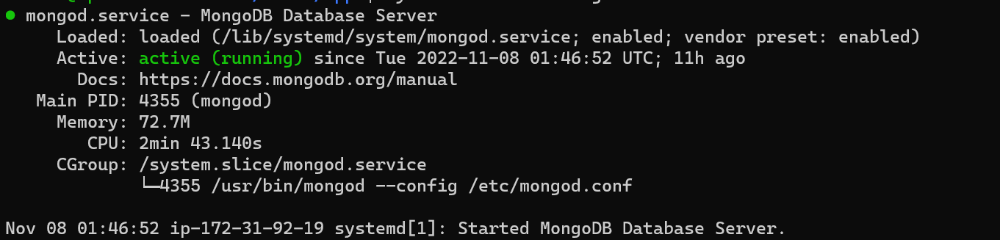
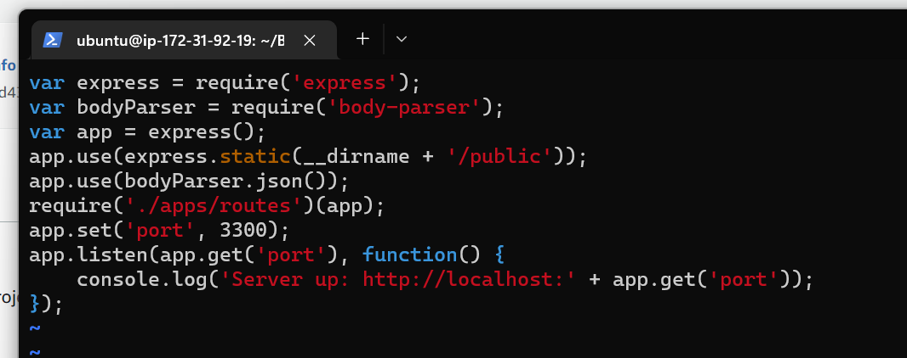
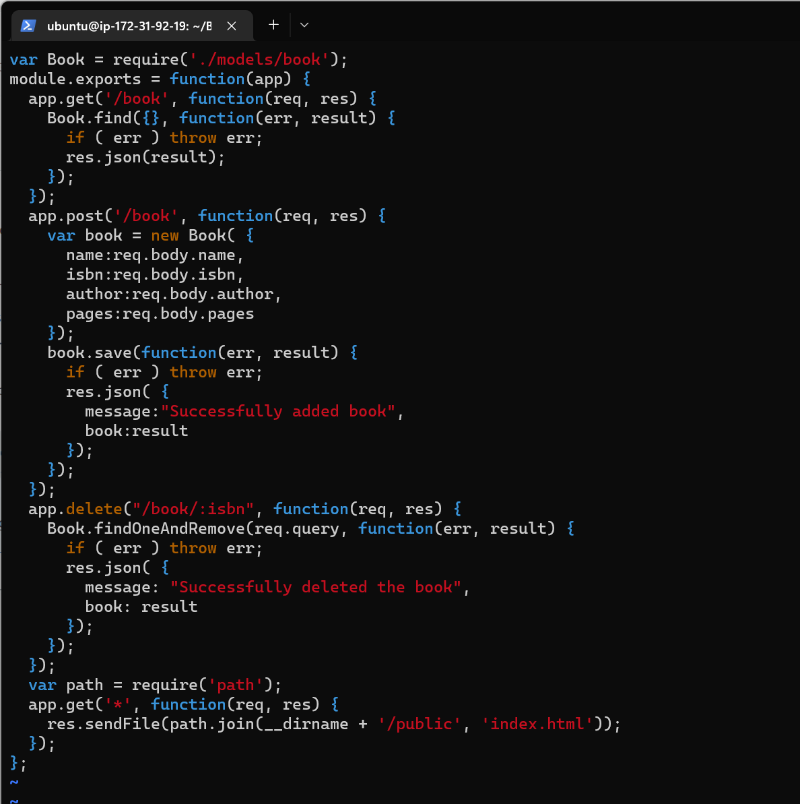
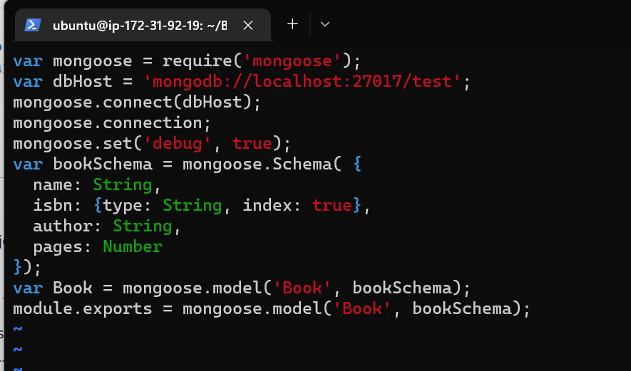
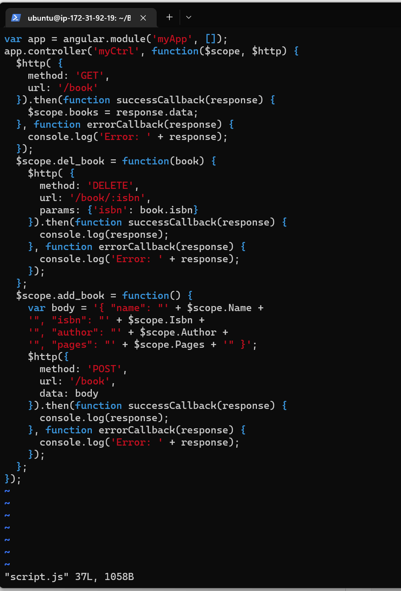
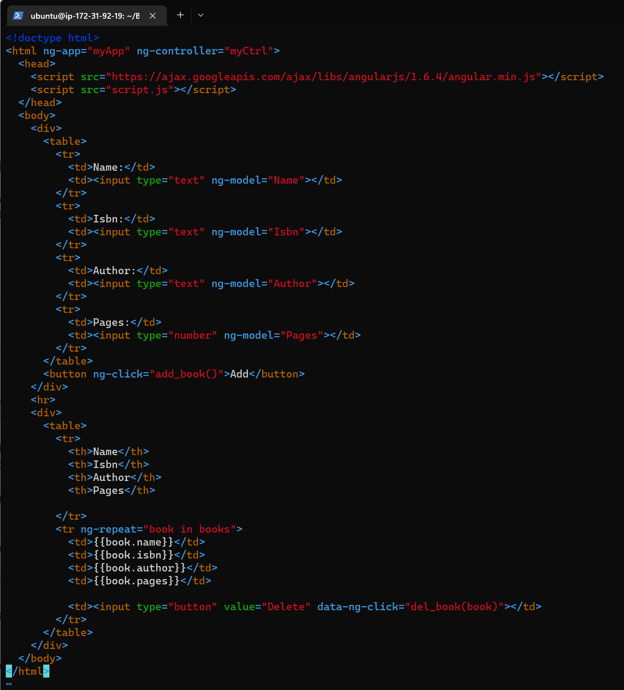
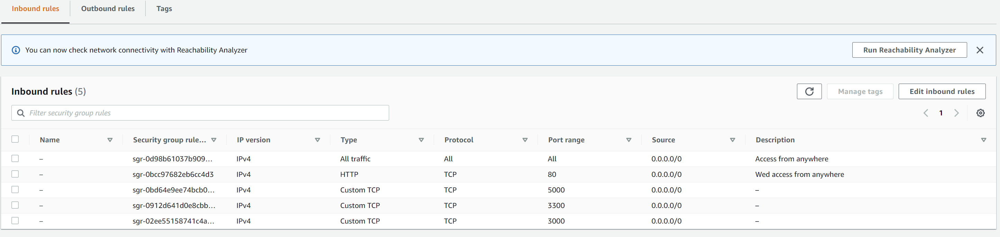
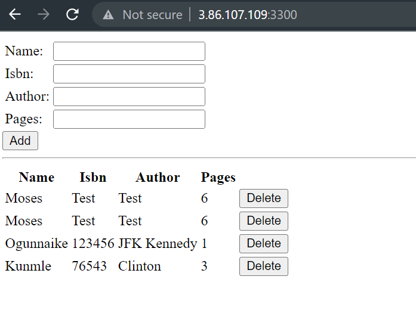

## Project 4: MEAN STACK DEPLOYMENT
### Install NodeJS
* sudo apt update
* sudo apt upgrade
### Add certificate
* sudo apt -y install curl dirmngr apt-transport-https lsb-release ca-certificates
* curl -sL https://deb.nodesource.com/setup_14.x | sudo -E bash -
* sudo apt install -y nodejs
### Install MongoDB
### Install mongoDB dependencies
* apt install dirmngr gnupg apt-transport-https ca-certificates software-properties-common
### Add MongoDB GPG Key
* wget -qO - https://www.mongodb.org/static/pgp/server-6.0.asc | sudo apt-key add -
* echo "deb [ arch=amd64,arm64 ] https://repo.mongodb.org/apt/ubuntu focal/mongodb-org/6.0 multiverse" | sudo tee /etc/apt/sources.list.d/mongodb-org-6.0.list
* apt-get update
* apt-get install -y mongodb-org
* systemctl enable --now  mongod

### Install *npm* - Node package manager
* sudo apt install -y npm
### Install body-parser package
* sudo npm install body-parser
* mkdir Books && cd Books
### In the Books directory, Initialize npm project
* sudo npm init
### Add a file to it named server.js
sudo vi server.js

### INSTALL EXPRESS AND SET UP ROUTES TO THE SERVER
* sudo npm install express mongoose
* mkdir apps && cd apps
### Create a file named routes.js
* vi routes.js

### In the ‘apps’ folder, create a folder named models
* mkdir models && cd models
* sudo vi book.js

## Access the routes with AngularJS
* cd ../..
### Create a folder named public
* mkdir public && cd public
### Add a file named script.js
* sudo vi script.js

### In public folder, create a file named index.html;
* vi index.html

### Change the directory back up to Books
* cd ..
### Start the server by running this command:
* sudo node server.js
### The server is now up and running, we can connect it via port 3300. You can launch a separate Putty or SSH console to test what curl command returns locally.
* curl -s http://localhost:3300
### Open port 3300 to have access from Internet

### Final project result

